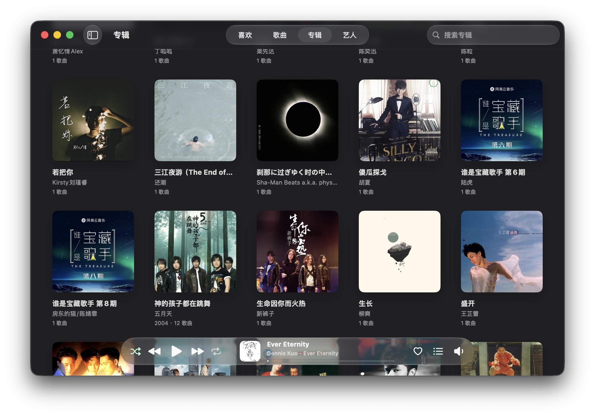
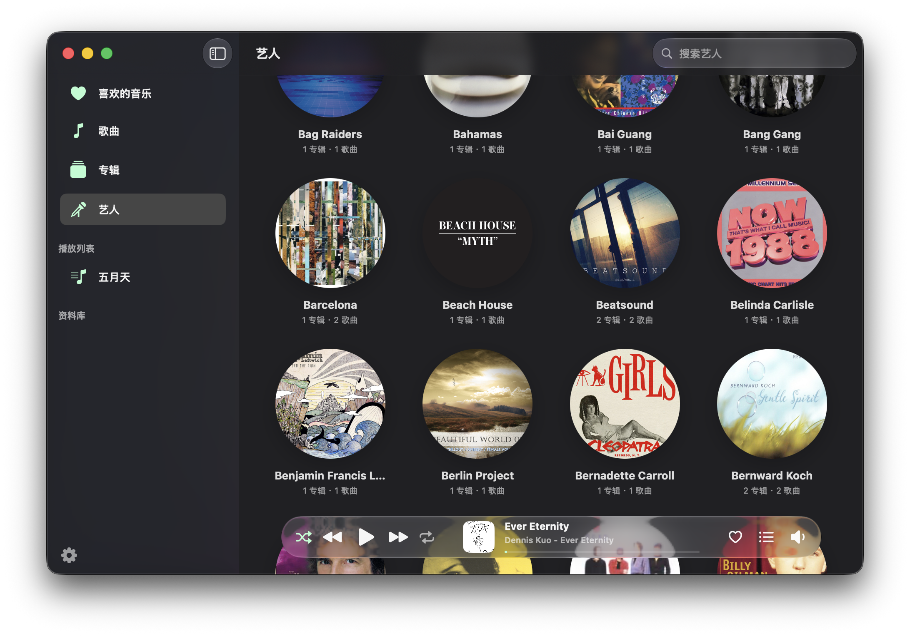
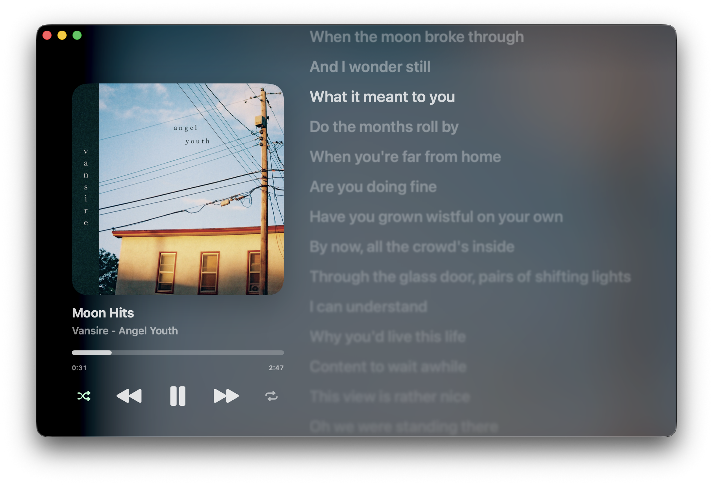

# Mint Player

[English](README.en.md) | 简体中文


Mint Player 是一款 macOS 原生的本地音乐播放器，使用熟悉的的 Liquid Glass 设计。

## 功能

- 支持常见音频文件，导入目录可递归扫描子目录
- 可按专辑、艺人分别显示曲目，支持自建播放列表
- 支持歌曲收藏、统计播放次数、屏蔽歌曲
- 支持歌词滚动显示

## 应用截图







## 构建

### 系统需求

- macOS 26.0 或更高版本
- 带 macOS 26 SDK 的 Xcode

### 快速开始

1. 在 Xcode 中打开 `MintPlayer.xcodeproj`。
2. 选择 `MintPlayer` scheme 和 `My Mac`。
3. 按 `Command + R` 运行。
4. 打开设置并添加本地音乐文件夹。
5. 通过侧栏浏览歌曲、专辑、艺人、喜欢、播放列表或资料库文件夹。

### 命令行

查看 Xcode 工程信息：

```sh
xcodebuild -list -project MintPlayer.xcodeproj
```

构建默认 scheme：

```sh
xcodebuild -project MintPlayer.xcodeproj -scheme "MintPlayer" -destination 'platform=macOS' build
```

构建指定配置：

```sh
xcodebuild -project MintPlayer.xcodeproj -scheme "MintPlayer" -configuration Debug -destination 'platform=macOS' build
xcodebuild -project MintPlayer.xcodeproj -scheme "MintPlayer" -configuration Release -destination 'platform=macOS' build
```

> [!note]
> Debug 构建会使用独立于 Release 构建的应用名称、Bundle ID、Application Support 目录和偏好设置前缀。

## 许可证

本项目使用 GPLv3 许可证。详见 `LICENSE`。

## 免责声明

> [!WARNING]
> 本应用由 Agent 辅助开发。使用前请自行审查代码。

> [!WARNING]
> 使用本应用的风险由你自行承担。作者不对使用本应用造成的问题负责。
