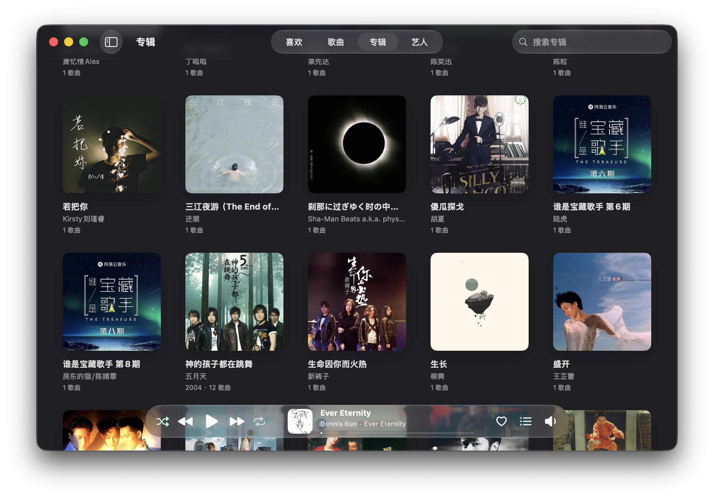
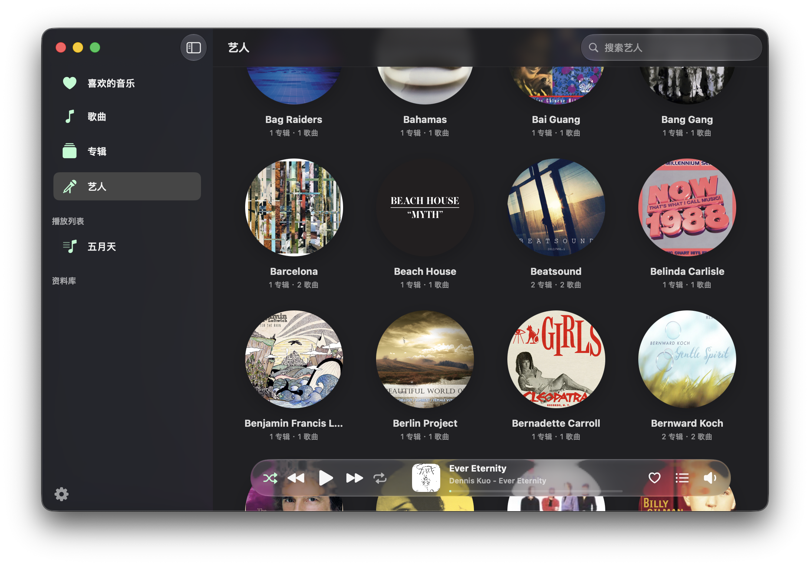
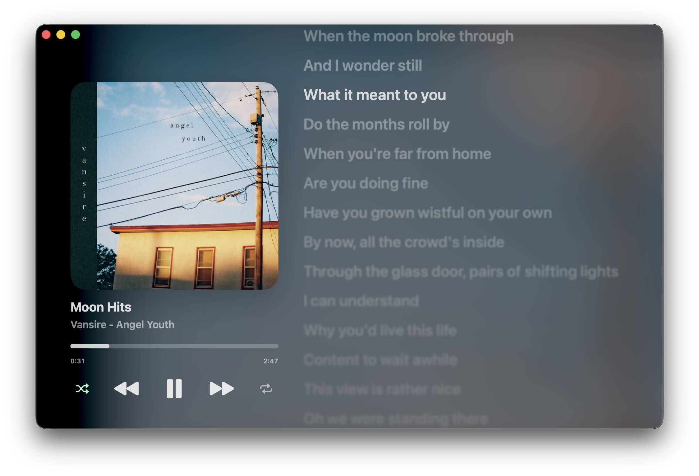

# Mint Player

[English](README.en.md) | 简体中文


Mint Player 是一款 macOS 原生的本地音乐播放器，使用熟悉的的 Liquid Glass 设计。

## 功能

- 支持常见音频文件，导入目录可递归扫描子目录
- 可按专辑、艺人分别显示曲目，支持自建播放列表
- 支持歌曲收藏、统计播放次数、屏蔽歌曲
- 支持歌词滚动显示
- 可选择开启本机 MCP 服务，让 Agent 搜索歌曲并控制播放与待播队列

## Agent 控制播放

在设置的「MCP」中开启「启用 MCP」。保持 Mint Player 运行，并在本机 MCP 客户端中填入设置页显示的地址。默认要求访问令牌：使用「复制令牌」取得令牌，在客户端中配置 `Authorization: Bearer <令牌>` 请求头。也可关闭「要求访问令牌」，此时本机客户端无需请求头即可连接，且本机任意进程都可以控制播放。服务默认关闭，仅监听 `127.0.0.1`；关闭服务开关或退出 App 后将无法连接。

令牌保存在当前用户的 App 专用目录中，不访问钥匙串。目录和令牌文件分别使用 `0700`、`0600` 权限；同一系统用户运行的进程仍可能读取该文件。从使用钥匙串存储令牌的版本升级后，需要重新复制令牌并更新 MCP 客户端。

默认端口为 Release `49431`、Debug `49432`，可在设置中修改。若端口被占用，设置页会显示启动失败原因，可修改端口后重试。重新生成令牌后，使用旧令牌的客户端需要更新配置。

MCP 工具支持搜索歌曲、艺人及专辑；按顺序或随机播放指定艺人、专辑；读取当前歌曲的完整歌词、播放状态与待播队列；控制播放、音量、进度和待播队列。歌曲通过资料库 UUID 选择，艺人与专辑通过搜索结果中的 ID 选择；工具结果不包含本地音频路径。

## 应用截图







## 构建

### 系统需求

- macOS 26.0 或更高版本
- 带 macOS 26 SDK 的 Xcode

### 快速开始

1. 在 Xcode 中打开 `MintPlayer.xcodeproj`。
2. 选择 `MintPlayer` scheme 和 `My Mac`。
3. 按 `Command + R` 运行。
4. 打开设置并添加本地音乐文件夹。
5. 通过侧栏浏览歌曲、专辑、艺人、喜欢、播放列表或资料库文件夹。

### 命令行

查看 Xcode 工程信息：

```sh
xcodebuild -list -project MintPlayer.xcodeproj
```

构建默认 scheme：

```sh
xcodebuild -project MintPlayer.xcodeproj -scheme "MintPlayer" -destination 'platform=macOS' build
```

构建指定配置：

```sh
xcodebuild -project MintPlayer.xcodeproj -scheme "MintPlayer" -configuration Debug -destination 'platform=macOS' build
xcodebuild -project MintPlayer.xcodeproj -scheme "MintPlayer" -configuration Release -destination 'platform=macOS' build
```

> [!note]
> Debug 构建会使用独立于 Release 构建的应用名称、Bundle ID、Application Support 目录和偏好设置前缀。

## 许可证

本项目使用 GPLv3 许可证。详见 `LICENSE`。

## 免责声明

> [!WARNING]
> 本应用由 Agent 辅助开发。使用前请自行审查代码。

> [!WARNING]
> 使用本应用的风险由你自行承担。作者不对使用本应用造成的问题负责。
