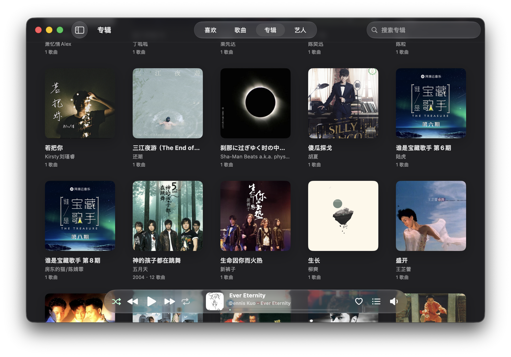
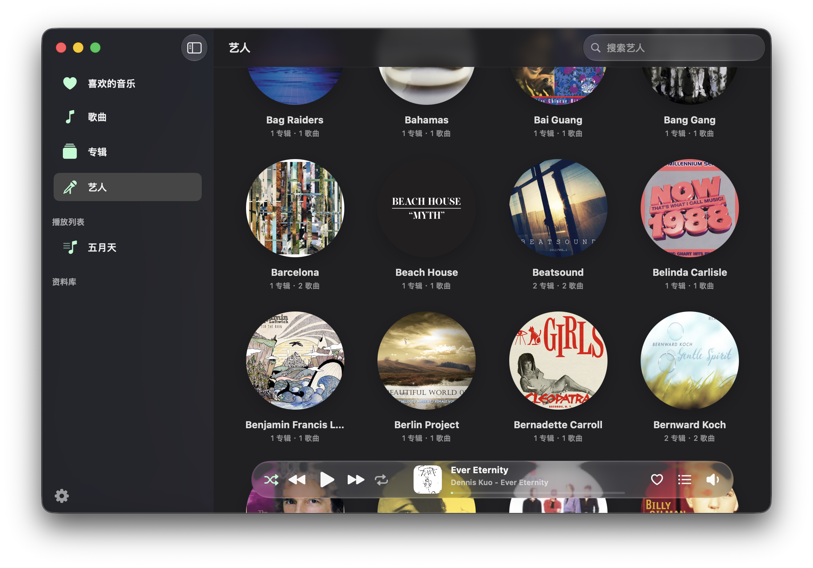
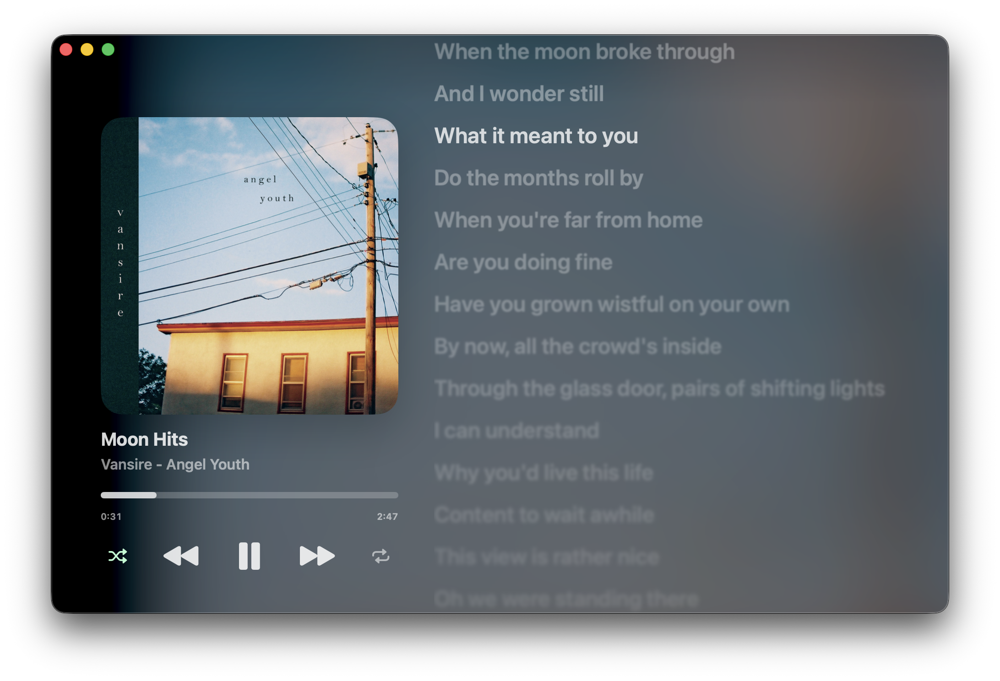

# Mint Player


Mint Player 是一款原生 macOS 本地音乐播放器，用于管理和播放你自己的音乐资料库。它面向把音频文件保存在本地磁盘的用户，提供本地优先的歌曲、播放列表、专辑、艺人和歌词体验，同时不改变原始文件夹结构。

## 功能

- 从用户选择的文件夹导入本地资料库。
- 播放常见本地音频文件，包括 `mp3`、`m4a`、`wav`、`aac`、`flac`、`ogg`、`aiff` 和 `aif`。
- 提供歌曲、专辑、艺人、喜欢、播放列表和资料库文件夹视图。
- 使用原生歌曲表格，支持选择、排序、列自定义、右键菜单、拖拽和双击播放。
- 支持按专辑和艺人浏览，显示封面缩略图，并在进入详情页时提供封面连续转场。
- 独立歌词窗口支持同步本地 `.lrc` 歌词、平滑滚动、非当前行可选模糊，以及窗口尺寸记忆。
- 支持播放队列、随机播放、循环、上一曲/下一曲、播放状态恢复和 Dock 菜单控制。
- 支持喜欢、屏蔽歌曲、有效播放次数统计和资料库状态持久化。
- 通过 Now Playing 和远程媒体控制与系统媒体功能集成。
- 设置中可调整主题、语言、歌词模糊、资料库文件夹、重新扫描和屏蔽歌曲管理。

## 截图







## 要求

- macOS 26.0 或更高版本
- 带 macOS 26 SDK 的 Xcode
- 可在应用中选择的本地音频文件夹

## 快速开始

1. 在 Xcode 中打开 `MintPlayer.xcodeproj`。
2. 选择 `MintPlayer` scheme 和 `My Mac`。
3. 按 `Command + R` 运行。
4. 打开设置并添加本地音乐文件夹。
5. 通过侧栏浏览歌曲、专辑、艺人、喜欢、播放列表或资料库文件夹。

## 资料库管理

Mint Player 会索引用户选择的文件夹，并把应用元数据单独保存在 Application Support 中。在应用中移除资料库文件夹只会删除应用内引用和内部索引记录，不会删除磁盘上的用户文件。

重新扫描资料库文件夹会更新已索引文件的元数据和封面。被屏蔽的歌曲会从常规资料库视图中隐藏，直到你在设置中取消屏蔽。

## 歌词

Mint Player 支持本地 `.lrc` 歌词。独立歌词窗口会跟随播放进度、高亮当前行，并支持点击歌词跳转播放位置。非当前歌词行的模糊效果可以在设置中开启或关闭。

## 构建

查看 Xcode 工程信息：

```sh
xcodebuild -list -project MintPlayer.xcodeproj
```

构建默认 scheme：

```sh
xcodebuild -project MintPlayer.xcodeproj -scheme "MintPlayer" -destination 'platform=macOS' build
```

构建指定配置：

```sh
xcodebuild -project MintPlayer.xcodeproj -scheme "MintPlayer" -configuration Debug -destination 'platform=macOS' build
xcodebuild -project MintPlayer.xcodeproj -scheme "MintPlayer" -configuration Release -destination 'platform=macOS' build
```

Debug 构建会使用独立于 Release 构建的应用名称、Bundle ID、Application Support 目录和偏好设置前缀。

## 开发说明

本仓库以 Xcode 工程作为唯一构建入口。目前没有 Swift Package manifest、第三方依赖 manifest、测试 target、Lint 配置或自定义构建脚本。

实现约束、架构说明和 Agent 维护规则见 `AGENTS.md`。

## 已知问题

- 主窗口顶部的 `scrollEdgeEffectStyle` 效果可能随机失效。

## 许可证

本项目使用 GPLv3 许可证。详见 `LICENSE`。

## 免责声明

> [!WARNING]
> 本应用由 Agent 辅助开发。使用前请自行审查代码。

> [!WARNING]
> 使用本应用的风险由你自行承担。作者不对使用本应用造成的问题负责。
