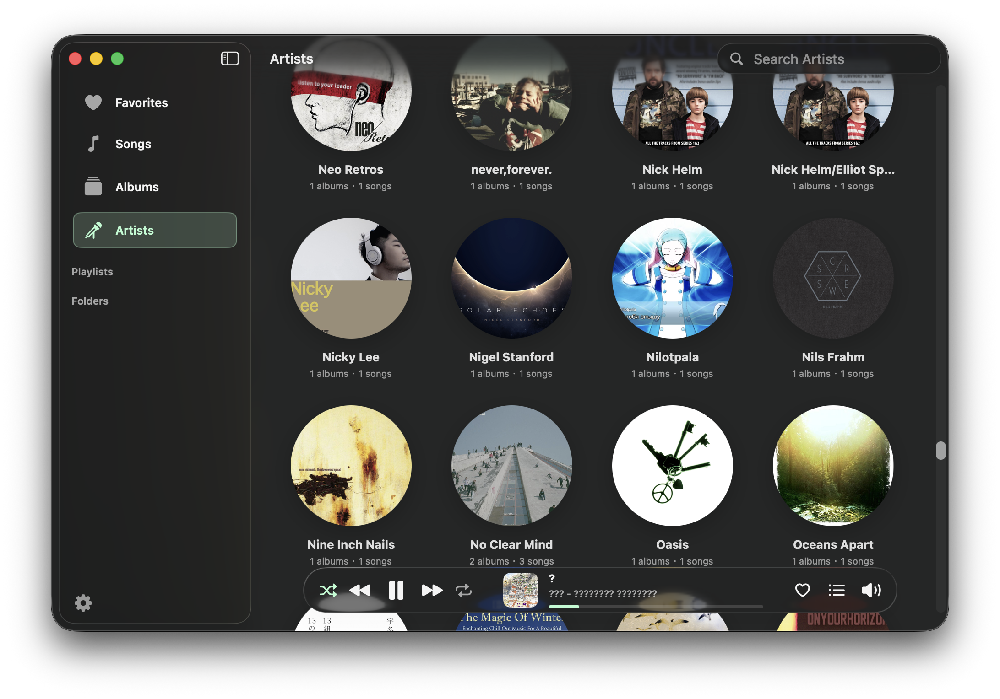
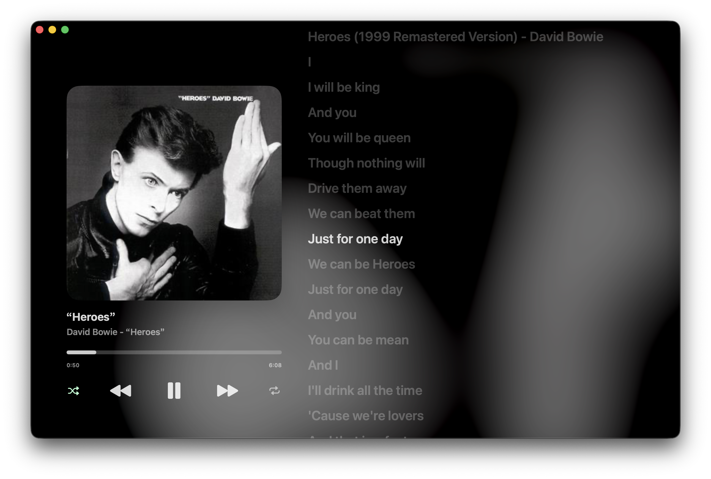

# Mint Player


美观、现代的 macOS 本地音乐播放器。

## 主要功能

- 美观熟悉的界面：使用液态玻璃设计，支持按照歌曲视图、按专辑视图、按艺人视图显示；
- 基于本地音乐库：导入本地音乐库，不影响其文件结构；
- 灵活的歌曲组织：支持自定义播放列表、喜欢的音乐列表、屏蔽歌曲和播放次数记录；
- 歌词显示：支持与歌曲文件同名且同目录的 `.lrc` 文件；带时间戳的歌词会同步滚动，不带时间戳的文本会作为纯文本歌词显示。

### 界面




## TODO

- ✅ 基本功能
- ⬜ 细节和动画优化
- ⬜ 音频淡入淡出过渡
- ⬜ 动态模糊背景
- ⬜ 统一主界面和歌词界面
- ⬜ 在线歌词搜索

### BUG

- ❌ 主界面上边缘 `scrollEdgeEffectStyle` 效果随机失效

## 构建

### 运行环境

- macOS 26.0 或更高版本
- 支持 macOS 26 SDK 的 Xcode

### XCode构建

1. 使用 Xcode 打开 `MintPlayer.xcodeproj`。
2. 选择 `MintPlayer` scheme 和 `My Mac`。
3. 按 `Command + R` 运行。
4. 在设置窗口中添加本地音乐文件夹。

### 命令行构建

```sh
xcodebuild -project MintPlayer.xcodeproj -scheme "MintPlayer" -destination 'platform=macOS' build
```

> [!TIPS]
> - Debug 构建会生成 `Mint Player Debug.app`
> - Release 构建会生成 `Mint Player.app`。

```sh
xcodebuild -project MintPlayer.xcodeproj -scheme "MintPlayer" -configuration Debug -destination 'platform=macOS' build
xcodebuild -project MintPlayer.xcodeproj -scheme "MintPlayer" -configuration Release -destination 'platform=macOS' build
```

## 许可证

本项目使用 GPLv3 许可证，详见 `LICENSE`。

## 声明

> [!WARNING]
> 本应用使用 Agent 构建，如果您不喜欢 AI 程序，请勿使用。

> [!WARNING]
> 请自行检查代码，作者不为使用本应用造成的任何问题负责。
